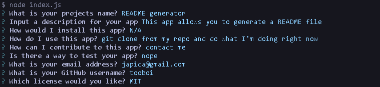

# README generator


## Description

This app allows the user to generate a README file based on a series of CLI prompts
  
## Installation

Using your bash terminal:

Check if you have node installed, this app was built using `v8.1.4`

```
npm -v
```

After you `git clone` , navigate to the folder containing `index.js` and install the node modules

```
npm install
```  

## Usage

Begin the prompts by running:

```
node index.js
```

What type of questions you will see:



Follow this [Video Walk through](https://drive.google.com/file/d/1Th0UO_-vF3jMRKJPd6jph9TWsoz3crKG/view) to see the app in action

## License

Protected under the [MIT license](./LICENSE).
